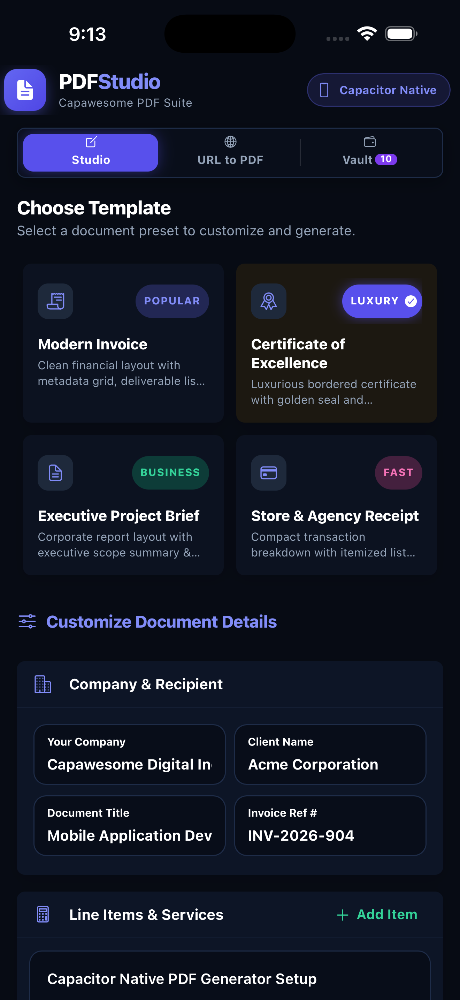
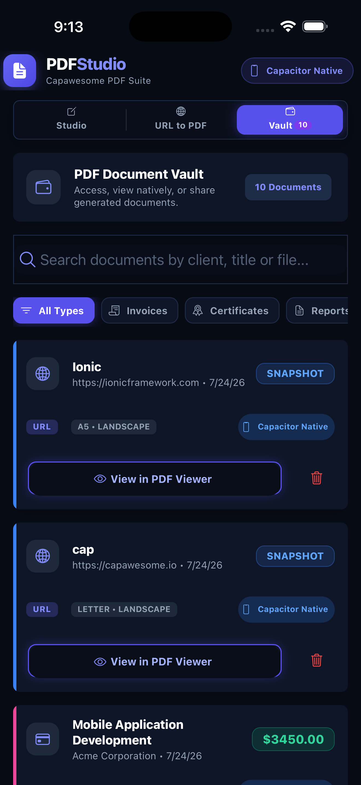
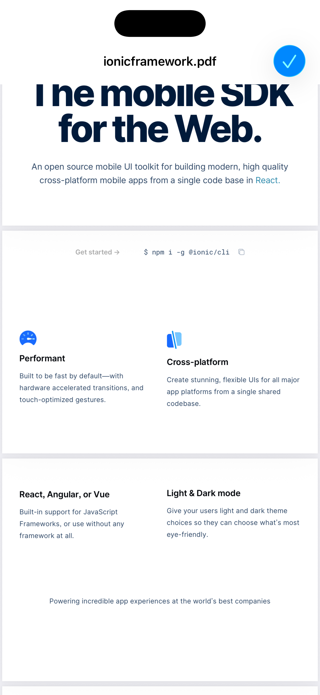
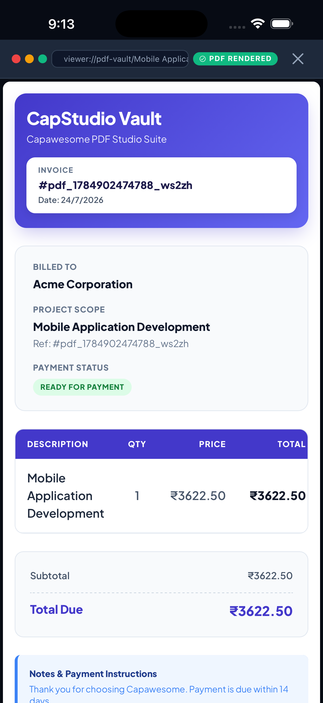
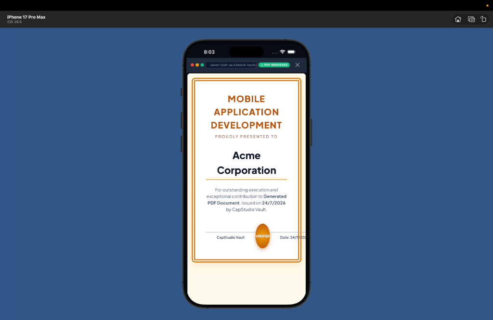
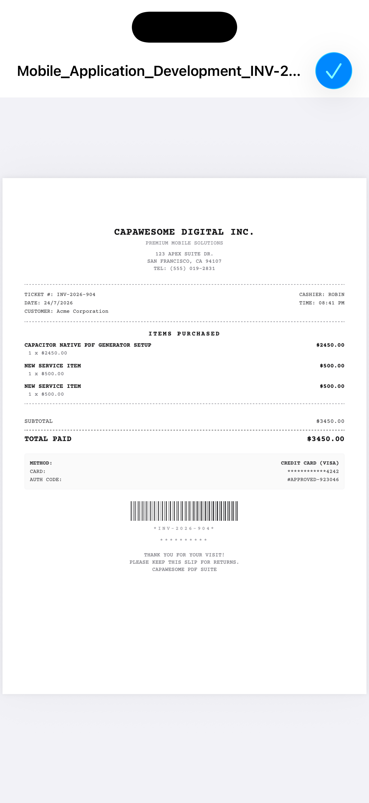
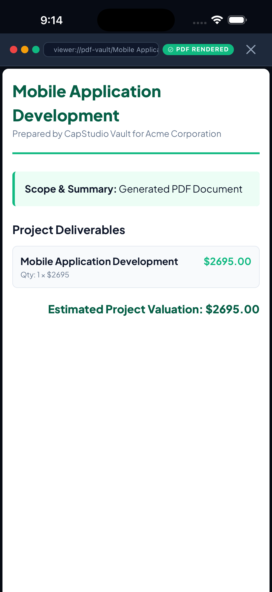
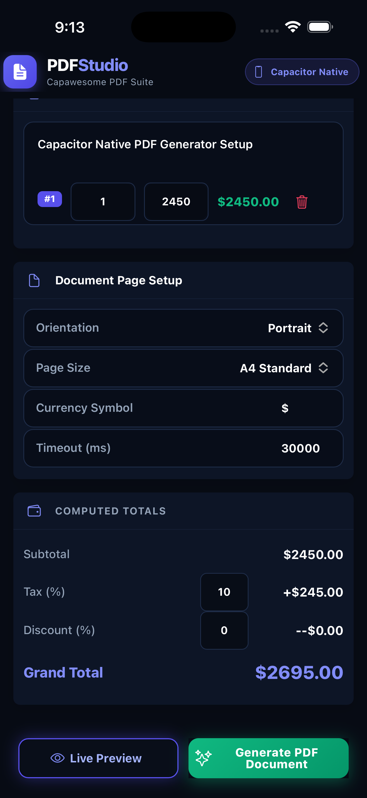
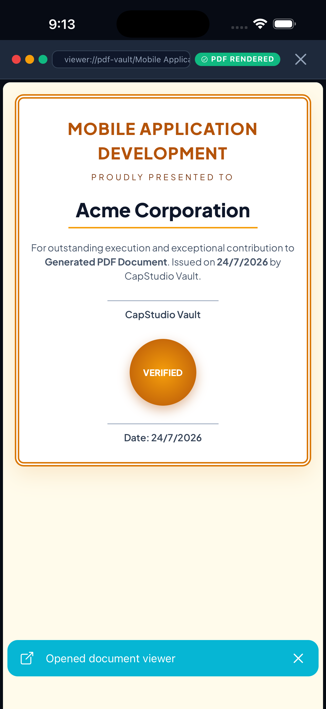

# PDFStudio: Premium Capacitor PDF Creator & Vault Suite

PDFStudio is a high-fidelity cross-platform Ionic/Angular application designed to create, preview, manage, and persist beautiful PDF documents. Built with **Ionic 8**, **Angular 19**, and the **Capawesome Capacitor PDF Suite**, it provides a sleek, dark-themed experience matching professional native document utility tools.

---

## 📱 App Walkthrough & Interface

<table width="100%">
  <tr>
    <td width="33%" align="center">
      <br />
      <sub><b>Creator Studio Form</b></sub>
    </td>
    <td width="33%" align="center">
      <br />
      <sub><b>Template Picker Modal</b></sub>
    </td>
    <td width="33%" align="center">
      <br />
      <sub><b>URL to PDF Converter</b></sub>
    </td>
  </tr>
  <tr>
    <td width="33%" align="center">
      <br />
      <sub><b>Invoice PDF Preview</b></sub>
    </td>
    <td width="33%" align="center">
      <br />
      <sub><b>Certificate PDF Preview</b></sub>
    </td>
    <td width="33%" align="center">
      <br />
      <sub><b>Receipt PDF Preview</b></sub>
    </td>
  </tr>
  <tr>
    <td width="33%" align="center">
      <br />
      <sub><b>Document Vault</b></sub>
    </td>
    <td width="33%" align="center">
      <br />
      <sub><b>Document Page Setup</b></sub>
    </td>
    <td width="33%" align="center">
      <br />
      <sub><b>Empty Vault State</b></sub>
    </td>
  </tr>
</table>

---

## ✨ Features

*   **Creator Studio Builder**: Dynamic invoice/brief forms with automated, real-time totals, tax, and discount percentages calculations.
*   **Template Design Options**:
    *   `Modern Invoice`: Clean indigo layout with automatic financial calculations.
    *   `Certificate of Excellence`: Gold-bordered luxury layout with centralized seals (fully responsive vertical stacking on mobile viewports).
    *   `Executive Project Brief`: Emerald green business brief outlining project deliverables.
    *   `Store & Agency Receipt`: Monospace POS thermal slip complete with CSS triangular jagged edges and linear gradient barcode.
*   **Capawesome Native Generator & Viewer**: Integrates native headless PDF compiling and full-screen iOS/Android PDF Viewer.
*   **Permanent Device Storage**: Uses `@capacitor/filesystem` to securely copy generated files from temporary cache into the user's permanent `Documents` directory.
*   **In-App Web Viewer Modal**: Bypasses browser popup blockers during local web debugging via an elegant simulated browser frame using secure HTML `srcdoc` iframe rendering.
*   **URL to PDF Snapshot**: Converts any target webpage into a vector-rendered PDF document with configurable page sizes, orientations, and custom load timeouts.
*   **Offline Document Vault**: Stores document record histories locally, featuring template-specific colored markers, instant quick filters, and action sheet triggers.
*   **System Aesthetics**:
    *   Native status bar styled dynamically (`Style.Dark` with `#070b14` background color).
    *   Haptic feedback integration on button clicks.

---

## 🛠️ Tech Stack

*   **Framework**: Ionic 8 & Angular 19 (Standalone Components)
*   **Language**: TypeScript, HTML5, SCSS
*   **Native Engine**: Capacitor 8 (with iOS and Android platforms)
*   **Plugins**:
    *   `@capawesome/capacitor-pdf-generator` (PDF creation)
    *   `@capawesome/capacitor-pdf-viewer` (Document viewing)
    *   `@capacitor/filesystem` (File persistence)
    *   `@capacitor/status-bar` (System style configurations)
    *   `@capacitor/haptics` (Physical user interaction feed)

---

## 🚀 Getting Started

### Prerequisites
Make sure you have Node.js (v18+) and the Ionic CLI installed.

```bash
npm install -g @ionic/cli
```

### Installation
1. Clone the repository and install project dependencies:
   ```bash
   npm install
   ```

2. Build the web distribution resources:
   ```bash
   npm run build
   ```

### Running the App
*   **Web Fallback (Browser)**:
    ```bash
    npm run start
    ```
    *(App runs at `http://localhost:8100/` with mock browser frames bypassing popup blockers)*

*   **iOS Emulator / Device**:
    ```bash
    npx cap sync ios
    npx cap run ios
    ```

*   **Android Emulator / Device**:
    ```bash
    npx cap sync android
    npx cap run android
    ```

---

## 📄 License

This project is licensed under the [MIT License](LICENSE).
